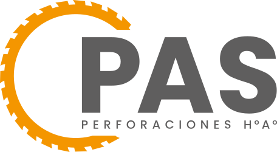

<div align="center">



# PAS — Piedra Angular Solutions

Landing page de **PAS**, empresa de perforaciones, cortes, anclajes y sellado de juntas en hormigón armado en CABA y Gran Buenos Aires.

[](https://github.com/pa-soluciones/landing/actions/workflows/ci.yml)
[](https://www.pasoluciones.com.ar)
[](https://github.com/pa-soluciones/landing/commits/master)

[](https://nextjs.org)
[](https://react.dev)
[](https://www.typescriptlang.org)
[](https://vercel.com)

[**pasoluciones.com.ar**](https://www.pasoluciones.com.ar)

</div>

---

## Contenido

- [Stack](#stack)
- [Primeros pasos](#primeros-pasos)
- [Estructura](#estructura)
- [Decisiones de diseño](#decisiones-de-diseño)
- [SEO y GEO](#seo-y-geo)
- [Analítica y privacidad](#analítica-y-privacidad)
- [CI y deploy](#ci-y-deploy)
- [Convenciones](#convenciones)

## Stack

| Área | Tecnología |
| --- | --- |
| Framework | Next.js 16 (App Router, páginas estáticas) · React 19 |
| Lenguaje | TypeScript |
| Estilos | CSS propio con design tokens en `globals.css` — sin Tailwind ni CSS Modules |
| Tipografías | Poppins + Outfit, self-hosted vía `next/font/local` |
| Librerías | `embla-carousel-react` · `lucide-react` |
| Hosting | Vercel, detrás de Cloudflare |

## Primeros pasos

Requiere **Node.js 22** y npm.

```bash
npm install
npm run dev
```

El sitio queda en [http://localhost:3000](http://localhost:3000). No hace falta configurar variables de entorno.

| Script | Descripción |
| --- | --- |
| `npm run dev` | Servidor de desarrollo |
| `npm run build` | Build de producción |
| `npm run start` | Sirve el build de producción |
| `npm run lint` | ESLint |

## Estructura

```
src/
├── app/
│   ├── layout.tsx            # metadata, Open Graph, JSON-LD, fuentes
│   ├── page.tsx              # home: compone las secciones
│   ├── globals.css           # design system completo (tokens, layout, animaciones)
│   ├── robots.ts             # robots.txt dinámico (reglas para crawlers de IA)
│   ├── sitemap.ts            # sitemap.xml dinámico
│   ├── cortes-de-hormigon-armado/  # landing del servicio de cortes
│   └── (legal)/              # política de privacidad y términos
├── components/               # una sección o pieza por archivo
│   ├── CookieConsent.tsx     # banner; carga GTM y Contentsquare solo con consentimiento
│   └── icons/                # SVG como componentes (incluye el logo animado)
├── hooks/                    # useReveal, useScrollBehavior
└── lib/
    ├── schema.ts             # schema.org: LocalBusiness, Organization, WebSite, FAQPage
    ├── faqData.ts            # preguntas frecuentes (alimenta la UI y el FAQPage)
    └── fonts.ts
public/
├── llms.txt                  # resumen del negocio para buscadores de IA
├── work-images/              # galería de trabajos (webp)
├── partners/                 # logos de clientes
└── fonts/ · ico/ · services/
```

## Decisiones de diseño

- **Logo animado en SVG.** El disco del logo gira con una animación CSS sobre un SVG inline (`icons/AnimatedLogo.tsx`). Reemplazó a un video WebM con canal alfa, que Safari no soporta: mostraba fondo negro y no arrancaba solo. El SVG pesa ~3 KB gzip, anima a la tasa de refresco del dispositivo y respeta `prefers-reduced-motion`.
- **Íconos que heredan color.** Los íconos usan `fill="currentColor"`, así los estados de hover se resuelven cambiando `color` desde CSS.
- **Imágenes.** WebP para fotos y SVG para íconos, siempre con `next/image` y `width`/`height` que respetan la proporción real del archivo, para evitar saltos de layout.

## SEO y GEO

- **Datos estructurados** en `<head>`: `LocalBusiness` con catálogo de servicios, `Organization`, `WebSite` y `FAQPage`.
- **Buscadores de IA:** `robots.ts` habilita GPTBot, OAI-SearchBot, ClaudeBot, PerplexityBot y Google-Extended, y bloquea los crawlers de entrenamiento masivo. `public/llms.txt` resume servicios, cobertura y contacto.
- **Dominio canónico:** `https://www.pasoluciones.com.ar`, definido una sola vez en `SITE_URL` (`src/lib/schema.ts`). Metadata, sitemap, robots y schema lo toman de ahí.
- **Locale** `es-AR` e imagen Open Graph de 1200×630.

Si se agrega una sección con preguntas frecuentes, sumarlas a `faqData.ts` para que entren en el schema `FAQPage`.

## Analítica y privacidad

Google Tag Manager (`GTM-PBZCGJDV`) y Contentsquare **no se cargan hasta que el usuario acepta** el banner de cookies. La preferencia se guarda en `localStorage` (`pas-cookie-consent`) y se puede cambiar desde la Política de Privacidad. El tratamiento de datos se rige por la Ley 25.326.

No agregar scripts de analítica fuera de `CookieConsent.tsx`.

## CI y deploy

Cada push y pull request a `master` corre [GitHub Actions](.github/workflows/ci.yml): `npm ci`, lint, typecheck y build. El sitio se sirve desde Vercel.

## Convenciones

Commits cortos y por área, con prefijo:

```
feat: agregar logos de clientes
fix: proporción del logo en el header
chore: actualizar dependencias
```

Las reglas para agentes de IA que trabajan en el repo están en [`AGENTS.md`](AGENTS.md).
